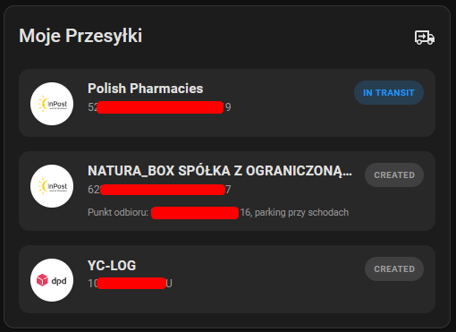

# Polish Shipment Tracking

English version: [README_EN.md](README_EN.md)




[](LICENSE)

Integracja dla Home Assistant do śledzenia przesyłek u popularnych przewoźników w Polsce. Tworzy encje sensor dla aktywnych przesyłek oraz zawiera kartę Lovelace z listą przesyłek.

## Funkcje

- Obsługa wielu przewoźników w jednej integracji (Config Flow)
- Encje sensor dla aktywnych przesyłek
- Normalizacja statusów na wspólny zestaw stanów
- Automatyczne wykrywanie nowych przesyłek oraz sprzątanie starych encji
- Wbudowana karta Lovelace:
  - serwowana przez integrację
  - automatyczna rejestracja zasobu w dashboardach w trybie storage

> [!TIP]
> Możesz dodać wiele kont / numerów dla tego samego przewoźnika (np. dla dwóch osób).

## Wspierani przewoźnicy

- InPost
- DHL
- DPD
- Pocztex

> [!WARNING]
> Integracja korzysta z nieoficjalnych API aplikacji/serwisów przewoźników. Te API mogą ulec zmianie bez uprzedzenia.

> [!CAUTION]
> Nie ponoszę odpowiedzialności za ewentualne blokady lub ograniczenia konta przez przewoźnika.


## Wymagania

- Home Assistant: 2024.6 lub nowszy
- (Opcjonalnie) HACS: 1.30 lub nowszy

## Instalacja

### Instalacja przez HACS (zalecane)

1. Otwórz HACS -> Integrations.
2. Dodaj repo jako Custom repository:
   - Repository: https://github.com/stirante/polish_shipment_tracking
   - Category: Integration
3. Zainstaluj integrację.
4. Zrestartuj Home Assistant.

### Instalacja ręczna

1. Skopiuj katalog `custom_components/polish_shipment_tracking` do:
   `<config>/custom_components/polish_shipment_tracking`
2. Zrestartuj Home Assistant.

## Konfiguracja

1. Ustawienia -> Urządzenia i usługi -> Dodaj integrację
2. Wyszukaj "Polish Shipment Tracking"
3. Wybierz przewoźnika i uzupełnij wymagane dane logowania
4. Zapisz

Po pierwszym odświeżeniu powinny pojawić się encje `sensor` dla przesyłek.

## Encje

Integracja tworzy encję `sensor` dla każdej aktywnej (niedostarczonej) przesyłki.

- unique_id: `<courier>_<shipment_id>`
- stan sensora: status znormalizowany (np. in_transport)
- atrybuty: zależnie od przewoźnika, przykładowo:
  - numer przesyłki
  - status surowy
  - historia zdarzeń
  - daty zdarzeń
  - informacje o punkcie odbioru

## Statusy (normalizacja)

Różne nazwy statusów przewoźników są mapowane do wspólnego zestawu. Przykładowo:
- created
- in_transport
- waiting_for_pickup
- delivered
- exception
- unknown

> [!NOTE]
> Mapowanie statusów nie jest jeszcze kompletne; PR-y z nowymi mapowaniami są mile widziane.

Dokładne mapowania są w kodzie integracji (sensor.py).

## Karta Lovelace


Integracja zawiera kartę Lovelace (JavaScript module) i automatycznie dodaje ją jako zasób w dashboardach.

## Debugowanie

Możesz włączyć debug logi dla integracji:

```yaml
logger:
  default: info
  logs:
    custom_components.polish_shipment_tracking: debug
```

## Znane problemy

* Zmiany po stronie przewoźników (API, autoryzacja, limity) mogą powodować błędy logowania lub pobierania przesyłek.

## Zgłoszenia błędów i wsparcie

* Issues: [https://github.com/stirante/polish_shipment_tracking/issues](https://github.com/stirante/polish_shipment_tracking/issues)
* Pull requests: mile widziane

W zgłoszeniu błędu dołącz:

* wersję Home Assistant
* logi (z włączonym debug dla integracji)
* wybranego przewoźnika
* opis kroków odtworzenia

## Licencja

GNU General Public License v3.0. Zobacz plik LICENSE.
