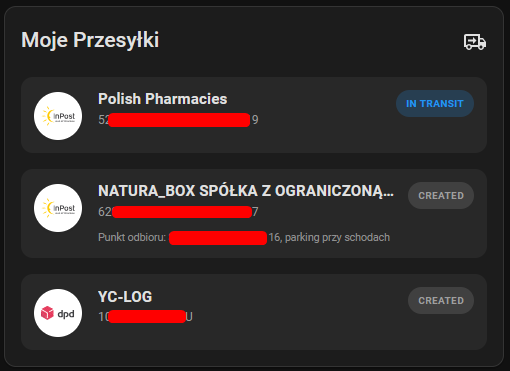

# Polish Shipment Tracking

Polska wersja: [README.md](README.md)




[](LICENSE)

Home Assistant integration for tracking shipments from popular carriers in Poland. It creates sensor entities for active shipments and includes a Lovelace card with a list of shipments.

## Features

- Multiple carriers supported in a single integration (Config Flow)
- Sensor entities for active shipments
- Status normalization into a common set of states
- Automatic discovery of new shipments and cleanup of old entities
- Built-in Lovelace card:
  - served by the integration
  - automatic resource registration for storage dashboards

> [!TIP]
> You can add multiple entries for the same carrier (e.g., your number and your spouse's account).

## Supported carriers

- InPost
- DHL
- DPD
- Pocztex
- GLS
- Allegro (orders, experimental)

> [!WARNING]
> The integration relies on unofficial APIs used by carrier apps/services. These APIs may change without notice.

> [!CAUTION]
> I am not responsible if a carrier blocks or limits a user account in any way.


## Requirements

- Home Assistant 2024.6 or newer
- (Optional) HACS 1.30 or newer

## Installation

### HACS (recommended)

1. Open HACS -> Integrations.
2. Add this repository as a Custom repository:
   - Repository: https://github.com/stirante/polish_shipment_tracking
   - Category: Integration
3. Install the integration.
4. Restart Home Assistant.

### Manual install

1. Copy `custom_components/polish_shipment_tracking` into:
   `<config>/custom_components/polish_shipment_tracking`
2. Restart Home Assistant.

## Configuration

1. Settings -> Devices and Services -> Add Integration
2. Search for "Polish Shipment Tracking"
3. Pick a carrier and provide the required credentials
4. Save

Sensor entities should appear after the first refresh.

### Allegro (experimental)

Allegro has no public API for buyers, so the integration uses your browser
session (the `QXLSESSID` cookie):

1. Sign in at [allegro.pl](https://allegro.pl) in a desktop browser.
2. Press F12. Firefox: Storage tab -> Cookies -> `https://allegro.pl`.
   Chrome / Edge: Application tab -> Cookies -> `https://allegro.pl`.
3. Copy the value of the `QXLSESSID` cookie and paste it when adding the Allegro account.

When the session expires, Home Assistant shows a reauthentication notification.
Paste a new cookie there.

Every Allegro order is a separate sensor with products, seller, timeline and
pickup point. When a carrier account (for example InPost) already tracks the
parcel, no Allegro sensor is created. Instead, the carrier parcel gets
`allegro_items`, `allegro_seller`, `allegro_order_id` and other attributes, and
the card shows the ordered products.

### Recipient filters

Each account's options (Configure) have:

- Show only parcels for: only parcels matching any pattern are shown,
- Hide parcels for: parcels matching any pattern are hidden.

One pattern per line (or comma separated). A pattern matches the recipient
phone number (the last 9 digits are compared, so the format does not matter),
name or address, including the pickup point address. Letter case and Polish
characters are ignored. A parcel is hidden only when the carrier provides data
to decide on. For example, a phone pattern does not hide a parcel whose carrier
does not report the recipient phone number.

## Entities

The integration creates one `sensor` per active (not delivered) shipment.

- unique_id: `<courier>_<shipment_id>`
- sensor state: normalized status (for example: in_transport)
- attributes: carrier-specific, commonly:
  - shipment number
  - raw status
  - event history
  - event timestamps
  - pickup point details

The integration also exposes a ready-for-pickup count on each courier account
device and one overall count across all configured accounts and couriers.
These counts use the normalized `waiting_for_pickup` status and decrease when
a parcel leaves the active list. The overall count includes every configured
account; use the account device sensors when accounts should stay separate.

## Events (custom)

The integration fires events on the `hass.bus`:

- `polish_shipment_tracking_new_shipment` - new shipment detected
- `polish_shipment_tracking_shipment_status_changed` - shipment status changed
- `polish_shipment_tracking_shipment_removed` - a tracked shipment disappeared
  from the carrier feed or was archived without a known terminal status

Example payload:

```json
{
  "courier": "inpost",
  "shipment_id": "1234567890",
  "entity_id": "sensor.inpost_paczka_1234567890",
  "status_raw": "in_transit",
  "status_key": "in_transport"
}
```

For `polish_shipment_tracking_shipment_status_changed`, additional fields are present:

- `old_status_raw`
- `old_status_key`
- `new_status_raw`
- `new_status_key`

Terminal status changes (`delivered`, `returned`, `cancelled`) are emitted before
the shipment sensor is removed. When the carrier omits the shipment entirely,
the integration waits for two consecutive successful polls before emitting
`polish_shipment_tracking_shipment_removed`, rather than guessing a final
status from one incomplete response. The parcel sensor remains available
during the first miss. The event includes the old status and a `reason` of
`missing_from_feed` or `archived` (for an explicit Pocztex archive marker).

## Status normalization

Carrier-specific status names are mapped to a common set, for example:
- created
- in_transport
- waiting_for_pickup
- delivered
- exception
- cancelled
- returned
- unknown

> [!NOTE]
> Status mapping is not complete yet; PRs with new mappings are welcome.

See the implementation in the integration code (sensor.py).

## Lovelace card


The integration bundles a Lovelace card (JavaScript module) and will automatically add it to Lovelace Resources.

## Debugging

Enable debug logs:

```yaml
logger:
  default: info
  logs:
    custom_components.polish_shipment_tracking: debug
```

## Known issues

* Carrier API/auth changes can break login or tracking.

## Issues and support

* Issues: [https://github.com/stirante/polish_shipment_tracking/issues](https://github.com/stirante/polish_shipment_tracking/issues)
* Pull requests are welcome.

When reporting a bug, include:

* Home Assistant version
* logs (with debug enabled)
* selected carrier
* reproduction steps

## License

GNU General Public License v3.0. See LICENSE.
